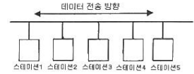

## 1과목: 소프트웨어 설계

### 01

운영체제 분석을 위해 리눅스에서 버전을 확인하고자 할 때 사용되는 명령어는?(문제 오류로 가답안 발표시 4번으로 발 표되었지만 확정답안 발표시 2, 4번이 정답처리 되었습니다. 여기서는 가답안인 4번을 누르시면 정답 처리 됩니다.)   

- [ ] ① ls 
- [ ] ② cat   
- [ ] ③ pwd 
- [x] ❹ uname 

### 02

통신을 위한 프로그램을 생성하여 포트를 할당하고, 클라이언 트의 통신 요청 시 클라이언트와 연결하는 내·외부 송·수신 연계기술은?  

- [ ] ① DB링크 기술 
- [x] ❷ 소켓 기술  
- [ ] ③ 스크럼 기술 
- [ ] ④ 프로토타입 기술 

### 03

객체지향 개념에서 연관된 데이터와 함수를 함께 묶어 외부 와 경계를 만들고 필요한 인터페이스만을 밖으로 드러내는 과정은?  

- [ ] ① 메시지(Message) 
- [x] ❷ 캡슐화(Encapsulation)   
- [ ] ③ 다형성(Polymorphism) 
- [ ] ④ 상속(Inheritance) 

### 04

GoF(Gangs of Four) 디자인 패턴의 생성패턴에 속하지 않는 것은?  

- [ ] ① 추상 팩토리(Abstract Factory) 
- [ ] ② 빌더(Builder)   
- [x] ❸ 어댑터(Adapter)  
- [ ] ④ 싱글턴(Singleton) 

### 05

응용프로그램의 프로시저를 사용하여 원격 프로시저를 로컬 프로시저처럼 호출하는 방식의 미들웨어는?  

- [ ] ① WAS(Web Application Server)   
- [ ] ② MOM(Message Oriented Middleware)   
- [x] ❸ RPC(Remote Procedure Call)   
- [ ] ④ ORB(Object Request Broker) 

### 06

바람직한 소프트웨어 설계 지침이 아닌 것은?  

- [ ] ① 모듈의 기능을 예측할 수 있도록 정의한다.   
- [ ] ② 이식성을 고려한다.   
- [ ] ③ 적당한 모듈의 크기를 유지한다.  
- [x] ❹ 가능한 모듈을 독립적으로 생성하고 결합도를 최대화한다.

### 07

객체지향 분석 방법론 중 Coad-Yourdon 방법에 해당하는 것은?  

- [x] ❶ E-R 다이어그램을 사용하여 객체의 행위를 데이터 모델 링하는데 초점을 둔 방법이다.   
- [ ] ② 객체, 동적, 기능 모델로 나누어 수행하는 방법이다.   
- [ ] ③ 미시적 개발 프로세스와 거시적 개발 프로세스를 모두 사 용하는 방법이다.   
- [ ] ④ Use-Case를 강조하여 사용하는 방법이다. 

### 08

다음은 어떤 프로그램 구조를 나타낸다. 모듈 F에서의 fan-in 과 fan-out의 수는 얼마인가?

- [ ] ① fan-in : 2, fan-out : 3 
- [x] ❷ fan-in : 3, fan-out : 2  
- [ ] ③ fan-in : 1, fan-out : 2 
- [ ] ④ fan-in : 2, fan-out : 1

### 09

현행 시스템 분석에서 고려하지 않아도 되는 항목은?  

- [ ] ① DBMS 분석 
- [ ] ② 네트워크 분석  
- [ ] ③ 운영체제 분석 
- [x] ❹ 인적 자원 분석 

### 10

분산 컴퓨팅 환경에서 서로 다른 기종 간의 하드웨어나 프로토콜, 통신환경 등을 연결하여 응용프로그램과 운영환경 간에 원만한 통신이 이루어질 수 있게 서비스를 제공하는 소프트웨어는?   

- [x] ❶ 미들웨어 
- [ ] ② 하드웨어   
- [ ] ③ 오픈허브웨어 
- [ ] ④ 그레이웨어 

### 11

CASE(Computer Aided Software Engineering)에 대한 설명으로 틀린 것은?   

- [ ] ① 소프트웨어 모듈의 재사용성이 향상된다.   
- [ ] ② 자동화된 기법을 통해 소프트웨어 품질이 향상된다.   
- [x] ❸ 소프트웨어 사용자들에게 사용 방법을 신속히 숙지시키기 위해 사용된다.   
- [ ] ④ 소프트웨어 유지보수를 간편하게 수행할 수 있다. 

### 12

UML(Unified Modeling Language)에 대한 설명 중 틀린 것은?   

- [ ] ① 기능적 모델은 사용자 측면에서 본 시스템 기능이며, UML에서는 Use case Diagram을 사용한다.   
- [ ] ② 정적 모델은 객체, 속성, 연관관계, 오퍼레이션의 시스템의 구조를 나타내며, UML에서는 Class Diagram을 사용한다.   
- [ ] ③ 동적 모델은 시스템의 내부 동작을 말하며, UML에서는 Sequence Diagram, State Diagram, Activity Diagram을 사용한다.   
- [x] ❹ State Diagram은 객체들 사이의 메시지 교환을 나타내며, Sequence Diagram은 하나의 객체가 가진 상태와 그 상태의 변화에 의한 동작순서를 나타낸다. 

### 13

기본 유스케이스 수행 시 특별한 조건을 만족할 때 수행하는 유스케이스는?   

- [ ] ① 연관 
- [x] ❷ 확장   
- [ ] ③ 선택 
- [ ] ④ 특화 

### 14

다음 중 요구사항 모델링에 활용되지 않는 것은?   

- [ ] ① 애자일(Agile) 방법   
- [ ] ② 유스케이스 다이어그램(Use Case Diagram)   
- [ ] ③ 시퀀스 다이어그램(Sequence Diagram)   
- [x] ❹ 단계 다이어그램(Phase Diagram) 

### 15

디자인 패턴을 이용한 소프트웨어 재사용으로 얻어지는 장점이 아닌 것은?   

- [ ] ① 소프트웨어 코드의 품질을 향상시킬 수 있다.   
- [x] ❷ 개발 프로세스를 무시할 수 있다.   
- [ ] ③ 개발자들 사이의 의사소통을 원활하게 할 수 있다.   
- [ ] ④ 소프트웨어의 품질과 생산성을 향상시킬 수 있다. 

### 16

럼바우(Rumbaugh) 분석기법에서 정보모델링이라고도 하며, 시스템에서 요구되는 객체를 찾아내어 속성과 연산 식별 및 객체들 간의 관계를 규정하여 다이어그램을 표시하는 모델 링은?   

- [x] ❶ Object 
- [ ] ② Dynamic   
- [ ] ③ Function 
- [ ] ④ Static 

### 17

소프트웨어를 개발하기 위한 비즈니스(업무)를 객체와 속성, 클래스와 멤버, 전체와 부분 등으로 나누어서 분석해 내는 기법은?   

- [x] ❶ 객체지향 분석 
- [ ] ② 구조적 분석   
- [ ] ③ 기능적 분석 
- [ ] ④ 실시간 분석 

### 18

애자일 소프트웨어 개발 기법의 가치가 아닌 것은?   

- [ ] ① 프로세스의 도구보다는 개인과 상호작용에 더 가치를 둔 다.   
- [ ] ② 계약 협상보다는 고객과의 협업에 더 가치를 둔다.   
- [x] ❸ 실제 작동하는 소프트웨어보다는 이해하기 좋은 문서에 더 가치를 둔다.   
- [ ] ④ 계획을 따르기보다는 변화에 대응하는 것에 더 가치를 둔다. 

### 19

UML 다이어그램 중 시스템 내 클래스의 정적 구조를 표현 하고 클래스와 클래스, 클래스의 속성 사이의 관계를 나타 내는 것은?   

- [ ] ① Activity Diagram 
- [ ] ② Modea Diagram   
- [ ] ③ State Diagram 
- [x] ❹ Class Diagram 

### 20

소프트웨어 설계시 제일 상위에 있는 main user function에 서 시작하여 기능을 하위 기능들로 분할해 가면서 설계하는 방식은?   

- [ ] ① 객체 지향 설계 
- [ ] ② 데이터 흐름 설계   
- [ ] ③ 상향식 설계 
- [x] ❹ 하향식 설계

## 2과목: 소프트웨어 개발

### 21

구현 단계에서의 작업 절차를 순서에 맞게 나열한 것은?

- [ ] ① ㉠-㉡-㉢-㉣ 
- [x] ❷ ㉡-㉠-㉣-㉢   
- [ ] ③ ㉢-㉠-㉡-㉣ 
- [ ] ④ ㉣-㉡-㉠-㉢ 

### 22 

다음 자료에 대하여 “Selection Sort”를 사용하여 오름차순 으로 정렬한 경우 PASS 3의 결과는?

`초기상태: 8, 3, 4, 9, 7`

- [x] ❶ 3, 4, 7, 9, 8 
- [ ] ② 3, 4, 8, 9, 7 
- [ ] ③ 3, 8, 4, 9, 7 
- [ ] ④ 3, 4, 7, 8, 9 

### 23 

하향식 통합시험을 위해 일시적으로 필요한 조건만을 가지고 임시로 제공되는 시험용 모듈은?   

- [x] ❶ Stub 
- [ ] ② Driver   
- [ ] ③ Procedure 
- [ ] ④ Function 

### 24 

다음 전위식(prefix)을 후위식(postfix)으로 옳게 표현한 것은?

`- / * A + B C D E`

- [ ]  ① A B C + D / * E - 
- [ ] ② A B * C D / + E -  
- [ ] ③ A B * C + D / E - 
- [x] ❹ A B C + * D / E -

### 25

그래프의 특수한 형태로 노드(Node)와 선분(Branch)으로 되어 있고, 정점 사이에 사이클(Cycle)이 형성되어 있지 않으며, 자료 사이의 관계성이 계층 형식으로 나타나는 비선형 구조는?   

- [x] ❶ tree 
- [ ] ② network   
- [ ] ③ stack 
- [ ] ④ distributed 

### 26 

스택에 대한 설명으로 틀린 것은?   

- [ ] ① 입출력이 한쪽 끝으로만 제한된 리스트이다.   
- [x] ❷ Head(front)와 Tail(rear)의 2개 포인터를 갖고 있다.   
- [ ] ③ LIFO 구조이다.   
- [ ] ④ 더 이상 삭제할 데이터가 없는 상태에서 데이터를 삭제하면 언더플로(Underflow)가 발생한다. 

### 27 

디지털 저작권 관리(DRM)에 사용되는 기술요소가 아닌 것은?   

- [ ] ① 키관리 
- [x] ❷ 방화벽   
- [ ] ③ 암호화 
- [ ] ④ 크랙방지

### 28

여러 개의 선택 항목 중 하나의 선택만 가능한 경우 사용하는 사용자 인터페이스(UI)요소는?   

- [ ] ① 토글 버튼 
- [ ] ② 텍스트 박스   
- [x] ❸ 라디오 버튼 
- [ ] ④ 체크 박스 

### 29

소프트웨어의 일부분을 다른 시스템에서 사용할 수 있는 정도를 의미하는 것은?   

- [ ] ① 신뢰성(Reliability)  
- [ ] ② 유지보수성(Maintainability)   
- [ ] ③ 가시성(Visibility)   
- [x] ❹ 재사용성(Reusability) 

### 30

 자료구조에 대한 설명으로 틀린 것은?   

- [x] ❶ 큐는 비선형구조에 해당한다.   
- [ ] ② 큐는 First In – First Out 처리를 수행한다.   
- [ ] ③ 스택은 Last In – First out 처리를 수행한다.   
- [ ] ④ 스택은 서브루틴 호출, 인터럽트 처리, 수식 계산 및 수식 표기법에 응용된다. 

### 31

 다음 중 블랙박스 검사 기법은?   

- [x] ❶ 경계값 분석 
- [ ] ② 조건 검사   
- [ ] ③ 기초 경로 검사 
- [ ] ④ 루프 검사 

### 32

 이진 검색 알고리즘에 대한 설명으로 틀린 것은?   

① 탐색 효율이 좋고 탐색 시간이 적게 소요된다. 

② 검색할 데이터가 정렬되어 있어야 한다.   

❸ 피보나치 수열에 따라 다음에 비교할 대상을 선정하여 검색한다.   

④ 비교횟수를 거듭할 때마다 검색 대상이 되는 데이터의 수가 절반으로 줄어든다. 

### 33

소프트웨어 품질목표 중 쉽게 배우고 사용할 수 있는 정도 를 나타내는 것은?   

① Correctness 

② Reliability   

❸ Usability 

④ Integrity 

### 34

 테스트 케이스에 일반적으로 포함되는 항목이 아닌 것은?   

① 테스트 조건 

② 테스트 데이터   

❸ 테스트 비용 

④ 예상 결과 

### 35

 소프트웨어 설치 매뉴얼에 포함될 항목이 아닌 것은?   

① 제품 소프트웨어 개요 

② 설치 관련 파일   

③ 프로그램 삭제 

❹ 소프트웨어 개발 기간 

### 36

소프트웨어 형상관리(Configuration management)에 관한 설명으로 틀린 것은?   

① 소프트웨어에서 일어나는 수정이나 변경을 알아내고 제 어하는 것을 의미한다.   

② 소프트웨어 개발의 전체 비용을 줄이고, 개발 과정의 여 러 방해 요인이 최소화되도록 보증하는 것을 목적으로 한다.   

❸ 형상관리를 위하여 구성된 팀을 “chief programmer team”이라고 한다.   

④ 형상관리의 기능 중 하나는 버전 제어 기술이다. 

### 37

 퀵 정렬에 관한 설명으로 옳은 것은?   

① 레코드의 키 값을 분석하여 같은 값끼리 그 순서에 맞는 버킷에 분배하였다가 버킷의 순서대로 레코드를 꺼내어 정렬한다.   

② 주어진 파일에서 인접한 두 개의 레코드 키 값을 비교하 여 그 크기에 따라 레코드 위치를 서로 교환한다.   

❸ 레코드의 많은 자료 이동을 없애고 하나의 파일을 부분 적으로 나누어 가면서 정렬한다.   

④ 임의의 레코드 키와 매개변수(h)값만큼 떨어진 곳의 레 코드 키를 비교하여 서로 교환해 가면서 정렬한다. 

### 38

 해싱 함수(Hashing Function)의 종류가 아닌 것은?   

① 제곱법(mid-square)   

② 숫자분석법(digit analysis)   

❸ 개방주소법(open addressing)   

④ 제산법(division) 

### 39

 필드 테스팅(field testing)이라고도 불리며 개발자 없이 고 객의 사용 환경에 소프트웨어를 설치하여 검사를 수행하는 인수검사 기법은?   

❶ 베타 검사 

② 알파 검사   

③ 형상 검사 

④ 복구 검사 

### 40

 다음 트리를 Preorder 운행법으로 운행할 경우 다섯 번째로 탐색되는 것은?

① C 

❷ E   

③ G 

④ H

## 3과목

###  41

결과 값이 아래와 같을 때 SQL 질의로 옳은 것은?

 ❶ SELECT * FROM 공급자 WHERE 공급자명 LIKE '%신%';   

② SELECT * FROM 공급자 WHERE 공급자명 LIKE '%대%';   

③ SELECT * FROM 공급자 WHERE 공급자명 LIKE '%사%';   

④ SELECT * FROM 공급자 WHERE 공급자명 IS NOT NULL;

### 42

다음에서 설명하는 스키마(Schema)는?

`데이터베이스 전체를 정의한 것으로 데이터개체, 관계, 제약조건, 접근권한, 무결성 규칙 등을 명세 한 것`

 ❶ 개념 스키마 

② 내부 스키마   

③ 외부 스키마 

④ 내용 스키마

### 43

데이터베이스 설계 단계 중 저장 레코드 양식설계, 레코드 집중의 분석 및 설계, 접근 경로 설계와 관계되는 것은?   

① 논리적 설계 

② 요구 조건 분석   

③ 개념적 설계 

❹ 물리적 설계

### 44

다음 릴레이션의 카디널리티와 차수가 옳게 나타낸 것은?

① 카디널리티 : 4, 차수 : 4 

❷ 카디널리티 : 4, 차수 : 6   

③ 카디널리티 : 6, 차수 : 4 

④ 카디널리티 : 6, 차수 : 6

### 45

다음과 같은 트랜잭션의 특성은?

`시스템이 가지고 있는 고정요소는 트랙잭션 수행전과 수행 완료 후의 상태가 같아야 한다.`

① 원자성(atomicity) 

❷ 일관성(consistency)   

③ 격리성(isolation) 

④ 영속성(durability)

### 46 

병행제어의 로킹(Locking) 단위에 대한 설명으로 옳지 않은 것은?   

① 데이터베이스, 파일, 레코드 등은 로킹 단위가 될 수 있 다.   

② 로킹 단위가 작아지면 로킹 오버헤드가 증가한다.   

③ 한꺼번에 로킹할 수 있는 단위를 로킹단위라고 한다.   

❹ 로킹 단위가 작아지면 병행성 수준이 낮아진다. 

### 47 

뷰(VIEW)에 대한 설명으로 옳지 않은 것은?   

① DBA는 보안 측면에서 뷰를 활용할 수 있다.   

② 뷰 위에 또 다른 뷰를 정의할 수 있다.   

❸ 뷰에 대한 삽입, 갱신, 삭제 연산 시 제약사항이 따르지 않는다.   

④ 독립적인 인덱스를 가질 수 없다.

### 48

다음 정의에서 말하는 기본 정규형은?

 ❶ 제1정규형(1NF)  

② 제2정규형(2NF)   

③ 제3정규형(3NF)  

④ 보이스/코드 정규형(BCNF) 

### 49

릴레이션 R1에 속한 애튜리뷰트의 조합인 외래키를 변경하 려면 이를 참조하고 있는 릴레이션 R2의 기본키도 변경해야 하는데 이를 무엇이라 하는가?   

① 정보 무결성 

② 고유 무결성   

③ 널 제약성 

❹ 참조 무결성 

### 50

 시스템 카탈로그에 대한 설명으로 틀린 것은?   

❶ 시스템 카탈로그의 갱신은 무결성 유지를 위하여 SQL을 이용하여 사용자가 직접 갱신하여야 한다.   

② 데이터베이스에 포함되는 데이터 객체에 대한 정의나 명 세에 대한 정보를 유지관리한다.

③ DBMS가 스스로 생성하고 유지하는 데이터베이스 내의 특별한 테이블의 집합체이다.   

④ 카탈로그에 저장된 정보를 메타 데이터라고도 한다. 

### 51

조건을 만족하는 릴레이션의 수평적 부분집합으로 구성하며, 연산자의 기호는 그리스 문자 시그마(σ)를 사용하는 관계대수 연산은?   

❶ Select 

② Project   

③ Join 

④ Division 

### 52

SQL에서 스키마(schema), 도메인(domain), 테이블(table), 뷰(view), 인덱스(index)를 정의하거나 변경 또는 삭제할 때 사용하는 언어는?   

① DML(Data Manipulation Language)   

❷ DDL(Data Definition Language)   

③ DCL(Data Control Language)   

④ IDL(Interactive Data Language) 

### 53

정규화를 거치지 않아 발생하게 되는 이상(anomaly) 현상의 종류에 대한 설명으로 옳지 않은 것은?   

① 삭제 이상이란 릴레이션에서 한 튜플을 삭제할 때 의도와는 상관없는 값들도 함께 삭제되는 연쇄 삭제 현상이다.   

② 삽입 이상이란 릴레이션에서 데이터를 삽입할 때 의도와는 상관없이 원하지 않는 값들도 함께 삽입되는 현상이다.   

③ 갱신 이상이란 릴레이션에서 튜플에 있는 속성값을 갱신할 때 일부 튜플의 정보만 갱신되어 정보에 모순이 생기는 현상이다.   

❹ 종속 이상이란 하나의 릴레이션에 하나 이상의 함수적 종속성이 존재하는 현상이다. 

### 54

관계 데이터 모델에서 릴레이션(relation)에 관한 설명으로 옳은 것은?   

① 릴레이션의 각 행을 스키마(schema)라 하며, 예로 도서 릴레이션을 구성하는 스키마에서는 도서번호, 도서명, 저자, 가격 등이 있다.   

② 릴레이션의 각 열을 튜플(tuple)이라 하며, 하나의 튜플은 각 속성에서 정의된 값을 이용하여 구성된다.   

❸ 도메인(domain)은 하나의 속성이 가질 수 있는 같은 타입의 모든 값의 집합으로 각 속성의 도메인은 원자값을 갖는다.   

④ 속성(attribute)은 한 개의 릴레이션의 논리적인 구조를 정의한 것으로 릴레이션의 이름과 릴레이션에 포함된 속성들의 집합을 의미한다. 

### 55

3NF에서 BCNF가 되기 위한 조건은?   

① 이행적 함수 종속 제거   

② 부분적 함수 종속 제거   

③ 다치 종속 제거   

❹ 결정자이면서 후보 키가 아닌 것 제거 

### 56

데이터베이스 성능에 많은 영향을 주는 DBMS의 구성 요소로 테이블과 클러스터에 연관되어 독립적인 저장 공간을 보유하며, 데이터베이스에 저장된 자료를 더욱 빠르게 조회하기 위하여 사용되는 것은?   

❶ 인덱스(Index) 

② 트랜잭션(Transaction)  

③ 역정규화(Denormalization) 

④ 트리거(Trigger)

### 57

아래의 SQL문을 실행한 결과는?

### 58

 『회원』테이블 생성 후 『주소』 필드(컬럼)가 누락되어 이 를 추가하려고 한다. 이에 적합한 SQL명령어는? 

① DELETE 

② RESTORE   

❸ ALTER 

④ ACCESS 

### 59

 트랜잭션을 수행하는 도중 장애로 인해 손상된 데이터베이스를 손상되기 이전에 정상적인 상태로 복구시키는 작업은?  

❶ Recovery 

② Commit   

③ Abort 

④ Restart 

### 60

 E-R 다이어그램의 표기법으로 옳지 않은 것은?   

① 개체타입 - 사각형  

② 속성 - 타원   

❸ 관계집합 - 삼각형  

④ 개체타입과 속성을 연결 – 선

## 4과목

### 61 

다음 중 응집도가 가장 높은 것은?   ① 절차적 응집도 ❷ 순차적 응집도   ③ 우연적 응집도 ④ 논리적 응집도 

### 62

 OSI 7계층에서 물리적 연결을 이용해 신뢰성 있는 정보를 전송하려고 동기화, 오류제어, 흐름제어 등의 전송에러를 제어하는 계층은?   ❶ 데이터 링크 계층 ② 물리 계층   ③ 응용 계층 ④ 표현 계층

### 63

 운영체제를 기능에 따라 분류할 경우 제어 프로그램이 아닌 것은?   ① 데이터 관리 프로그램 ❷ 서비스 프로그램  ③ 작업 제어 프로그램 ④ 감시 프로그램 

### 64 

IEEE 802.3 LAN에서 사용되는 전송매체 접속제어(MAC) 방식은?   ❶ CSMA/CD ② Token Bus   ③ Token Ring ④ Slotted Ring

### 65 

기억공간이 15K, 23K, 22K, 21K 순으로 빈 공간이 있을 때 기억장치 배치 전력으로 “First Fit”을 사용하여 17K의 프로그램을 적재할 경우 내부단편화의 크기는 얼마인가?   ① 5K ❷ 6K   ③ 7K ④ 8K 

### 66

교착상태가 발생할 수 있는 조건이 아닌 것은?   

① Mutual exclusion 

② Hold and wait   

③ Non-preemption 

❹ Linear wait 

### 67

 IPv6에 대한 설명으로 틀린 것은?   

❶ 멀티캐스팅(Multicast) 대신 브로드캐스트(Broadcast)를 사용한다.   

② 보안과 인증 확장 헤더를 사용함으로써 인터넷 계층의 보안기능을 강화하였다.   

③ 애니캐스트(Anycast)는 하나의 호스트에서 그룹 내의 가장 가까운 곳에 있는 수신자에게 전달하는 방식이다.   

④ 128비트 주소체계를 사용한다. 

### 68

 TCP/IP 프로토콜에서 TCP가 해당하는 계층은?   

① 데이터 링크 계층 

② 네트워크 계층   

❸ 트랜스포트 계층 

④ 세션 계층

### 69

C언어에서 변수로 사용할 수 없는 것은?   

① data02 

② int01   

③ _sub 

❹ short

### 70

 다음 JAVA 코드 출력문의 결과는?

 ① 5 + 2 = 345 + 2 = 34   

② 5 + 2 + 3 + 45 + 2 = 7   

③ 7 = 77 + 7   

❹ 5 + 2 = 345 + 2 = 7 

### 71

C언어에서 문자열을 정수형으로 변환하는 라이브러리 함수 는?   

❶ atoi( ) 

② atof( )   

③ itoa( ) 

④ ceil( ) 

### 72

 운영체제의 가상기억장치 관리에서 프로세스가 일정 시간동 안 자주 참조하는 페이지들의 집합을 의미하는 것은?   

① Locality 

② Deadlock   

③ Thrashing 

❹ Working Set 

### 73 

결합도가 낮은 것부터 높은 순으로 옳게 나열한 것은?     

① (ㄱ) → (ㄴ) → (ㄹ) → (ㅂ) → (ㅁ) → (ㄷ)   

② (ㄴ) → (ㄹ) → (ㅁ) → (ㅂ) → (ㄷ) → (ㄱ)   

❸ (ㄴ) → (ㄹ) → (ㅂ) → (ㅁ) → (ㄷ) → (ㄱ)   

④ (ㄱ) → (ㄴ) → (ㄹ) → (ㅁ) → (ㅂ) → (ㄷ)

### 74

다음 설명의 ㉠과 ㉡에 들어갈 내용으로 옳은 것은?

❶ ㉠ : Paging, ㉡ : Segmentation   

② ㉠ : Segmentation, ㉡ : Allocation   

③ ㉠ : Segmentation, ㉡ : Compaction   

④ ㉠ : Paging, ㉡ : Linking 

### 75

 라이브러리의 개념과 구성에 대한 설명 중 틀린 것은?   

① 라이브러리란 필요할 때 찾아서 쓸 수 있도록 모듈화되 어 제공되는 프로그램을 말한다.   

② 프로그래밍 언어에 따라 일반적으로 도움말, 설치 파일, 샘플 코드 등을 제공한다.   

❸ 외부 라이브러리는 프로그래밍 언어가 기본적으로 가지 고 있는 라이브러리를 의미하며, 표준 라이브러리는 별도의 파일 설치를 필요로 하는 라이브러리를 의미한다.   

④ 라이브러리는 모듈과 패키지를 총칭하며, 모듈이 개별 파일이라면 패키지는 파일들을 모아 놓은 폴더라고 볼 수 있다. 

### 76

C언어에서 산술 연산자가 아닌 것은?   

① % 

② *   

③ / 

❹ = 

### 77

UDP 특성에 해당되는 것은?   

① 양방향 연결형 서비스를 제공한다.   

② 송신중에 링크를 유지관리하므로 신뢰성이 높다.   

③ 순서제어, 오류제어, 흐름제어 기능을 한다.   

❹ 흐름제어나 순서제어가 없어 전송속도가 빠르다. 

### 78

 JAVA에서 변수와 자료형에 대한 설명으로 틀린 것은?   

① 변수는 어떤 값을 주기억 장치에 기억하기 위해서 사용하는 공간이다.   

② 변수의 자료형에 따라 저장할 수 있는 값의 종류와 범위가 달라진다.   

❸ char 자료형은 나열된 여러 개의 문자를 저장하고자 할 때 사용한다.   

④ boolean 자료형은 조건이 참인지 거짓인지 판단하고자 할 때 사용한다.

### 79

다음은 파이썬으로 만들어진 반복문 코드이다. 이 코드의 결과는?

 ❶ A, B, C 출력이 반복된다.   

② A, B, C 까지만 출력된다.   

③ A, B, C, D 출력이 반복된다.   

④ A, B, C, D 까지만 출력된다.

### 80

 WAS(Web Application Server)가 아닌 것은?   

① JEUS 

❷ JVM   

③ Tomcat 

④ WebSphere

## 5과목

### 81

다음 암호 알고리즘 중 성격이 다른 하나는?   

① MD4 

② MD5   

③ SHA-1 

❹ AES 

### 82

 크래커가 침입하여 백도어를 만들어 놓거나, 설정파일을 변경했을 때 분석하는 도구는?   

❶ tripwire 

② tcpdump   

③ cron 

④ netcat 

### 83

 다음 내용이 설명하는 것은?

 ① GRID 

② TELNET   

③ GPN 

❹ MQTT 

### 84

나선형(Spiral) 모형의 주요 태스크에 해당되지 않는 것은?   

❶ 버전 관리 

② 위험 분석   

③ 개발 

④ 평가

### 85

정보 보안을 위한 접근통제 정책 종류에 해당하지 않는 것 은?   

① 임의적 접근 통제 

❷ 데이터 전환 접근 통제   

③ 강제적 접근 통제 

④ 역할 기반 접근 통제

### 86

LOC기법에 의하여 예측된 총 라인수가 36,000라인, 개발에 참여할 프로그래머가 6명, 프로그래머들의 평균 생산성이 월간 300라인일 때 개발에 소요되는 기간은?   

① 5개월 

② 10개월   

③ 15개월 

❹ 20개월 

### 87

 정형화된 분석 절차에 따라 사용자 요구사항을 파악, 문서 화하는 체계적 분석방법으로 자료흐름도, 자료사전, 소단위 명세서의 특징을 갖는 것은?  

❶ 구조적 개발 방법론 

② 객체지향 개발 방법론   

③ 정보공학 방법론 

④ CBD 방법론 

### 88

정보보호를 위한 암호화에 대한 설명으로 틀린 것은?   

① 평문 – 암호화되기 전의 원본 메시지   

② 암호문 – 암호화가 적용된 메시지   

❸ 복호화 – 평문을 암호문으로 바꾸는 작업   

④ 키(Key) - 적절한 암호화를 위하여 사용하는 값

### 89

다음 내용이 설명하는 것은?

① OTT 

❷ Baas   

③ SDDC 

④ Wi-SUN 

### 90

소프트웨어 비용 산정 기법 중 개발 유형으로 organic, semi-detach, embedded로 구분되는 것은?   

① PUTNAM 

❷ COCOMO   

③ FP 

④ SLIM

### 91

다음 LAN의 네트워크 토폴로지는 어떤 형인가?

① 그물형 

② 십자형   

❸ 버스형 

④ 링형 

### 92

전기 및 정보통신기술을 활용하여 전력망을 지능화, 고도화함으로써 고품질의 전력서비스를 제공하고 에너지 이용효율을 극대화하는 전력망은?   

① 사물 인터넷 

❷ 스마트 그리드   

③ 디지털 아카이빙 

④ 미디어 빅뱅 

### 93

다음 내용이 설명하는 소프트웨어 개발 모형은?

① 프로토타입 모형 

② 나선형 모형   

❸ 폭포수 모형 

④ RAD 모형

### 94

스트림 암호화 방식의 설명으로 옳지 않은 것은?   

① 비트/바이트/단어들을 순차적으로 암호화한다.   

❷ 해쉬 함수를 이용한 해쉬 암호화 방식을 사용한다.   

③ RC4는 스트림 암호화 방식에 해당한다.   

④ 대칭키 암호화 방식이다.

### 95

세션 하이재킹을 탐지하는 방법으로 거리가 먼 것은?   

❶ FTP SYN SEGNENT 탐지   

② 비동기화 상태 탐지   

③ ACK STORM 탐지   

④ 패킷의 유실 및 재전송 증가 탐지

### 96

소프트웨어공학에 대한 설명으로 거리가 먼 것은?   

① 소프트웨어공학이란 소프트웨어의 개발, 운용, 유지보수 및 파기에 대한 체계적인 접근 방법이다.   

② 소프트웨어공학은 소프트웨어 제품의 품질을 향상시키고 소프트웨어 생산성과 작업 만족도를 증대시키는 것이 목적이다.   

❸ 소프트웨어공학의 궁극적 목표는 최대의 비용으로 계획된 일정보다 가능한 빠른 시일 내에 소프트웨어를 개발하는 것이다.   

④ 소프트웨어공학은 신뢰성 있는 소프트웨어를 경제적인 비용으로 획득하기 위해 공학적 원리를 정립하고 이를 이용하는 것이다.

### 97

소프트웨어 개발 방법론 중 CBD(Component Based Development)에 대한 설명으로 틀린 것은?   

① 생산성과 품질을 높이고, 유지보수 비용을 최소화할 수있다.   

② 컴포넌트 제작 기법을 통해 재사용성을 향상시킨다.   

❸ 모듈의 분할과 정복에 의한 하향식 설계방식이다.   

④ 독립적인 컴포넌트 단위의 관리로 복잡성을 최소화할 수 있다.

### 98

정보 보안의 3요소에 해당하지 않는 것은?   

① 기밀성 

② 무결성   

③ 가용성 

❹ 휘발성 

### 99

소셜 네트워크에서 악의적인 사용자가 지인 또는 특정 유명 인으로 가장하여 활동하는 공격 기법은?(문제 오류로 가답 안 발표시 1번으로 발표되었지만 확정답안 발표시 1, 2번이 정답처리 되었습니다. 여기서는 가답안인 1번을 누르시면 정답 처리 됩니다.)   

❶ Evil Twin Attack 

② Phishing   

③ Logic Bomb 

④ Cyberbullying

### 100

공개키 암호에 대한 설명으로 틀린 것은?   

❶ 10명이 공개키 암호를 사용할 경우 5개의 키가 필요하 다.   

② 복호화키는 비공개 되어 있다.   

③ 송신자는 수신자의 공개키로 문서를 암호화한다.   

④ 공개키 암호로 널리 알려진 알고리즘은 RSA가 있다.

