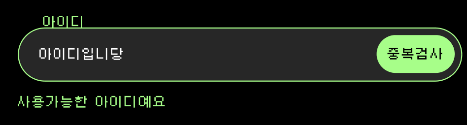
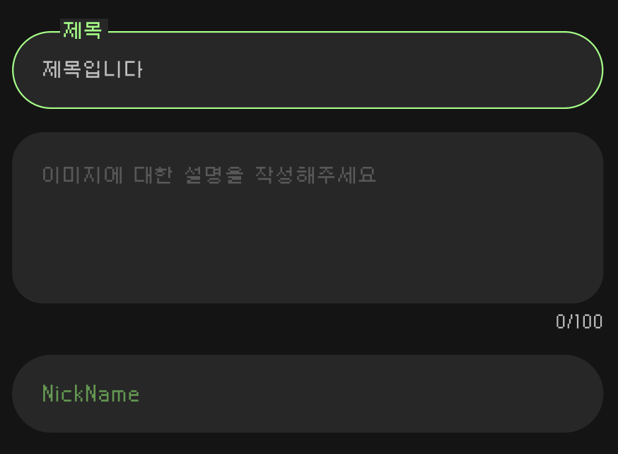
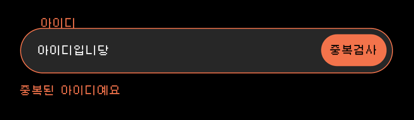

## Input 컴포넌트를 만들어보자(2)

컴포넌트를 만들려고 뚝딱뚝딱! 하다보니까 또 느껴집니다.

`초기 설정 및 설계의 중요성`

무작정 디자인한 화면을 만들려고 하니까 뭔가 설계하고 만드는 것이 아닌 추가되는 지저분한 컴포넌트가 만들어지는 느낌!

다시 만들어봐야겠습니다.

### Const와 function의 차이

코드를 살펴보니 `const`랑 `function`으로 만드는 컴포넌트의 차이가 뭘까 궁금했습니다!

뭔가 정의는 알지만 실질적인 장점이나 자주 사용되는 예와 같이 정확한 기준이 필요했습니다!

리액트에서 `const`로 만드는 컴포넌트와 `function`으로 만드는 컴포넌트는 주로 코드 스타일과 `Hooks`사용 여부에 따라 구분됩니다.

리액트 16.8 버전 이후 `Hooks`가 도입되면서 함수형 컴포넌트로 모든 것을 작성하는 추세가 강해졌고, 이에 따라 `const`로 정의된 컴포넌트가 많이 사용됩니다.

- `const`로 만드는 컴포넌트

  `const`로 정의하는 컴포넌트는 함수형 컴포넌트로 주로 사용됩니다. 리액트 훅을 사용할 때 선호됩니다.

  상태와 사이드 이펙트를 쉽게 관리할 수 있기 때문에 함수형 컴포넌트가 기본이 되었습니다.

  const로 정의 된 함수형 컴포넌트는 재할당을 피하고, 해당 함수가 변하지 않도록 보장합니다.

  - 장점

    상태관리와 사이드 이펙트가 간단해진다.

    컴포넌트의 코드가 명확하게 구성된다.

    

    

- `function`으로 만드는 컴포넌트

  `function`키워드를 사용한 컴포넌트는 전통적인 함수형 컴포넌트입니다. 

  훅 도입이전에 많이 사용됨

이 두 방식은 결과적으로 같은 컴포넌트를 만들수 있지만, 동작 방식과 사용 시점에 약간의 차이가 있습니다.

**`const`와 `function`의 차이점**은 주로 **호이스팅**, **`this` 바인딩 방식** 및 **재할당 가능성**에서 차이가 있습니다.

**화살표 함수(`const`)**는 `this`를 다루지 않고, 함수가 변하지 않도록 **상수**로 사용하는 경우에 적합합니다.

**일반 함수(`function`)**는 **호이스팅**과 `this` 바인딩을 다루는 경우에 유용하지만, 리액트에서 함수형 컴포넌트를 작성할 때는 `const` 방식으로 정의하는 것이 더 현대적인 방식입니다.

### Input에는 뭐가 필요할까?

디자인한 Input을 보고 분류해보겠습니다.

기본적으로 Input 하는 곳이 필요합니다.

input box는  focus 하면 border가 활성화 됩니다.

그리고 label이 처음에 placeholdr 처럼 내부에 있다가 focus되면 border 위로 올라갑니다.

버튼이 있습니다. 이 버튼은 있거나 없을 수 있습니다.

input 아래에는 현 상태에 대한 메시지가 나타납니다. 

input의 크기는 100% 입니다. 또한 textarea 버전이 존재하고 textarea일때는 하단에 글자 수를 확인 할 수 있습니다.

Error 상태일 때는 border와 label message 그리고 버튼이 붉은 색으로 나타냅니다.

