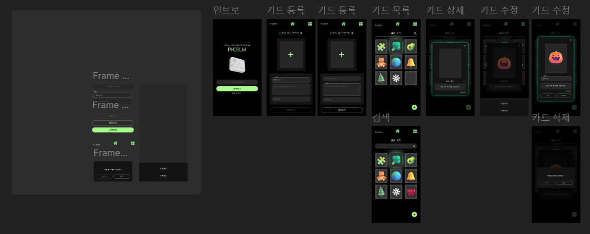

## 기획

우선 리팩토링을 하기 전에 피그마로 웹크기로 제작했던 디자인을 정리하고 화면을 구성해봤습니다.

제가 만들 사이트는 웹앱으로 포켓몬스터 3D Card를 보고 만들어 보고싶어서 나만의 포토카드(?)를 생성하는 사이트 입니다.

 이전에 html과 springboot를 사용해서 만든적 있는 웹페이지인데 이를 react, Typescript를 활용해 웹앱크기로 재구성해보려고 합니다.

아무래도 백엔드를 혼자 해봐야하기 때문에 전처럼 스프링부트를 사용할지 아니면 파이어베이스를 사용해서 제작할지 고민하다가 파이어베이스를 사용하겠습니다.

회원가입 및 로그인은 일반회원 가입과 간편로그인을 제공합니다.

  {: notice--primary}

이번에 프로젝트의 목표는 회원가입에 대한 이해를 하고, 이미지 최적화를 위해 노력하는 것 입니다.

프로젝트 기간은 1달입니다.(2025/01/08~2025/02/08)

원래는 새해를 맞이해서 덕담을 주고 받는 사이트를 기획하다가 일을 크게 벌리지 말고 우선 제가 경험했지만 정리되지 않은 것을 정리하려고 돌아왔습니다.

프로젝트 이름인 PHOBUM은 포토+ 앨범의 줄임말입니다.

## 스킬

- Frontend
  - React
  - TypeScript
- Backend
  - Firebase

## 디자인

우선 초기 피그마는 이런식으로 디자인 했습니다.

제가 웹으로 생성했던 디자인에서 조금 변경이 있었습니다.

또한 이번에도 디자인 시스템과 스타일북을 생성할 것 이기 때문에 초반 정리를 제대로 하고 진행하려고 합니다.

처음 웹으로 제작했던 것에는 로그인 기능이 없었기 때문에 로그인 페이지를 추가해야합니다. 

또한 카드 공유 기능을 추가해 공유할 수 있도록 합니다.

## 폴더구조

폴더구조를 살펴보다가 Sunny님의 블로그에서 네이버의  폴더 구조에 대해서 분석하신 글을 보게 되었습니다.

[https://joong-sunny.github.io/react/react7/](https://joong-sunny.github.io/react/react7/)

위를 참고하여 작성해보겠습니다.

---

이전에 진행했던 peauty를 리팩토링하려고 보니 너무 볼륨이 커서 진행하기 망설여집니다. 서버가 내려가서 로그인도 안되기 때문에 `msw`나 도커등을 공부하고 적용할 수 있는 기회가 있었으면 좋겠습니다.