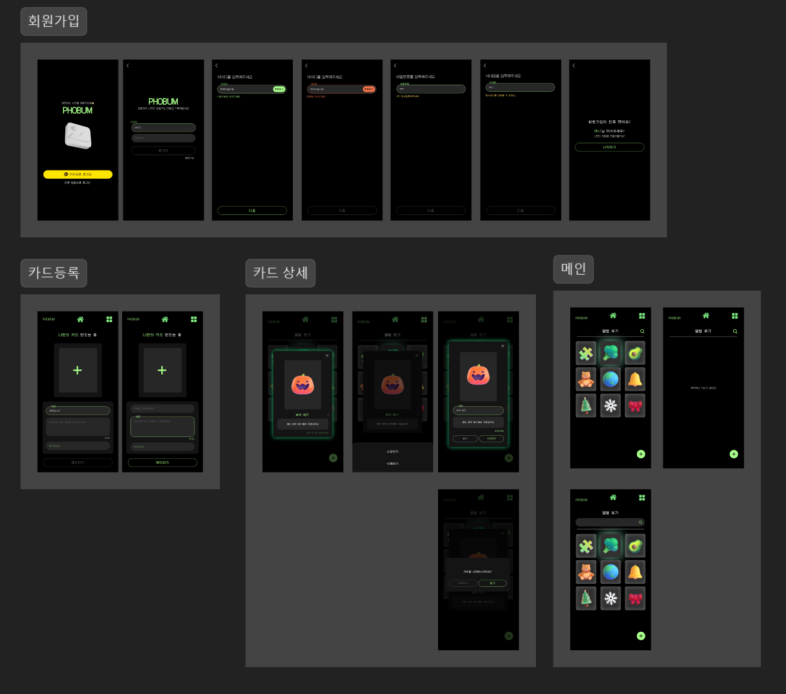

## 디자인 시스템


일단 대략적인 디자인 시스템을 정리했습니다.

컴포넌트 생성할 것과 아닌것을 구별해 공통컴포넌트로 제작해야할 것을 분리해서 만들어 두었습니다.

### 피그마

와이어프레임은 따로 생성하지 않고 바로 디자인을 했습니다.

저는 전공자가 아니라서 와이어프레임 같이 초반에 다져놔야할 것들에 많이 어색합니다..




로그인, 회원가입 화면을 추가했습니다.

## 세팅

`typescript`를 사용하고 `yarn`을 사용하면서 우선 초기 세팅을 해주었습니다.


### 절대경로

저번 프로젝트를 진행하면서 절대 경로가 적용되지 않아 코드가 많이 지저분했었는데 이번엔 꼭 적용하고 싶었습니다.


여기서 궁금증이 생겼습니다.

{: notice}

`tsconfig.json`과 `tsconfig.app.json`의 차이가 뭘까?


### tsconfig.json과 tsconfig.app.json

tsconfig.json과 tsconfig.app.json은 모두 Typescript 프로젝트에서 사용하는 설정 파일입니다.

두 파일은 비슷하지만, 각각 다른 역할과 목적을 가지고 있습니다.


#### tsconfig.json

TypeScript 프로젝트의 <span style="hlm">루트 설정 파일</span>입니다.

프로젝트 전체에서 공통으로 사용되는 컴파일 옵션을 정의하고, TypeScript 컴파일러가 어떻게 코드를 변환할지에 대한 설정을 포함합니다.


컴파일러 옵션, 포함될 파일 및 제외할 파일, 사용할 라이브러리 등을 설정하며

`comiperOptions`와 같은 설정은 tsconfig.json에서 정의해서 프로젝트 전체에 적용됩니다.


또한 `include`와`exclude`를 사용하여 어떤 파일이 컴파일에 포함될지 또는 제외될지를 설정합니다.


#### tsconfig.app.json

주로 <span style=
"hlm">앱</span> 설정을 다룬 파일입니다.

특정 설정에서 `tsconfig.json`을 기반으로 추가적인 설정을 적용할 때 사용됩니다. 

이 파일은 보통 애플리케이션의 <span style="hlm">빌드 설정을 담당</span>하며, `tsconfig.json`에서 상속받은 설정을 덧붙여서 사용합니다.


### 절대경로 설정은 어디서?

일반적으로 `tsconfig.json`파일 내에서 `baseUrl`과 `paths` 옵션을 사용해서 적용합니다.

 

`baseUrl`은 모든 상 대 경로의 기준이 되는 디랙토리를 설정합니다. 

예를 들어서 `baseUrl`을 `src`로 설정하면 `src`디렉토리 내의 모든 파일은 절대 경로처럼 접근할 수 있습니다.


`paths`는 `baseUrl`을 기준으로 별칭을 설정하여, 특정 디렉토리나 파일을 더 간결한 경로로 접근할 수 있게 합니다.


추가적으로 `include`와 `exclude`로 컴파일할 파일을 지정할 때 사용할 수 있습니다.

`baseUrl`과 `paths`가 올바르게 작동하려면, 이옵션들이 설정한 디렉토리를 포함해야합니다.

``` json
{
  "include": 
    ["src"]
}

```

