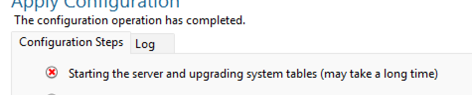
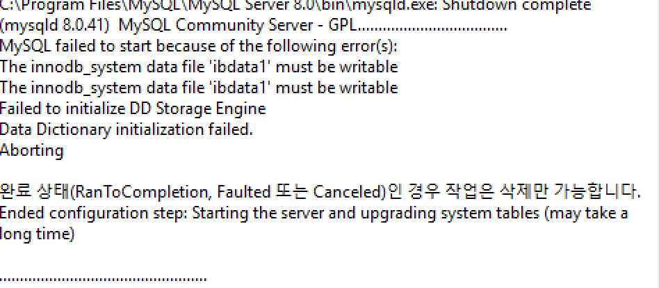
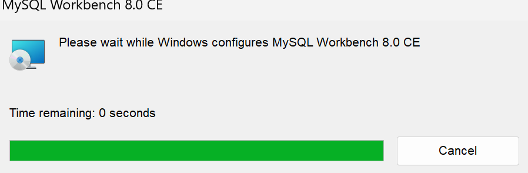

## My SQL Workbench 설치

위와 같이 초기 세팅을하는데

Shell은 MySQL 데이터베이스와 직접 상호작용을 할 수 있는 `CLI`(명령줄 인터페이스)를 제공합니다. 그래서 굳이 사용 안해도 될 것 같아서

이 두가지만 다운 받아줍니다.

여기서 root 비밀번호를 설정해주는데, 비밀번호를 잊지 않도록 합니다.

그리고 설치!

### 에러발생

Log를 살펴보니

이런 오류가 발생했습니다.

**InnoDB** 스토리지 엔진의 **`ibdata1`** 파일이 쓸 수 없다는 오류입니다. 이는 MySQL이 **데이터 파일**에 접근할 수 없기 때문에 발생하는 문제입니다. 보통은 **권한 문제**나 **디스크 상태** 때문에 이 문제가 발생할 수 있습니다. 

그래서 해결방안으로는 권한을 주고 다시 실행해보거나 삭제하고 재설치해보는 방법이 있는데, 저는 삭제하고 재설치하겠습니다.

삭제중...

무사히 삭제가 완료 됐습니다.

### 재설치

이제 재설치 해보겠습니다.

**Customer**를 선택해서 `Next`를 눌러줍니다

Server와 Workbench 최신버전을 선택하여 `Next` ! 

Shell이나 Document는 설치하지 않습니다.

 

설치하려고 보니까 이미 있다고 하니 얘네를 싹 지워주겠습니다.

폴더를 삭제하려니까 안되서 작업관리자를 열어서 mysql이 돌아가는 파일을 중단하고 삭제했습니다. 

이제 다시 설치해줍니다.

이거는 기본 세팅 그대로 `Next` 넘어갑니다.

비밀번호를 설정해줍니다.

Window Service에서는 체크가 제대로 잘 되어있는지 확인하면 되는데 이때 이름을 그대로 두어도 되고 `MySQL`로 바꾸어도 됩니다.

다음 누르고 설치를 시작합니다.

설치 완료!