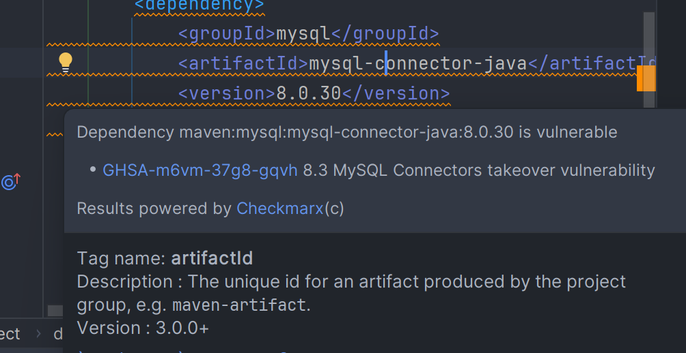

## My SQL 연결

workbench를 설치하고나서 table을 생성했습니다.


이 DB를 spring boot와 연결하겠습니다.


### MySQL JDBC Driver 의존성 추가

`pom.xml` 파일에 MySQL JDBC 드라이버 의존성을 추가해야합니다.


``` properties
# 데이터베이스 연결 설정
spring.datasource.url=jdbc:mysql://localhost:3306/phobum?useSSL=false&serverTimezone=UTC
spring.datasource.username=root        # MySQL 사용자명
spring.datasource.password=root        # MySQL 비밀번호
spring.datasource.driver-class-name=com.mysql.cj.jdbc.Driver

# JPA 설정 (JPA 사용 시)
spring.jpa.hibernate.ddl-auto=update   # 데이터베이스 스키마 자동 생성 (create, update, validate 등)
spring.jpa.show-sql=true               # SQL 쿼리 로그 출력 여부
spring.jpa.properties.hibernate.format_sql=true

# 로그 설정 (선택 사항)
logging.level.org.hibernate.SQL=debug   # Hibernate SQL 쿼리 로그 레벨
logging.level.org.hibernate.type.descriptor.sql=trace   # SQL 파라미터 값 로그

```

