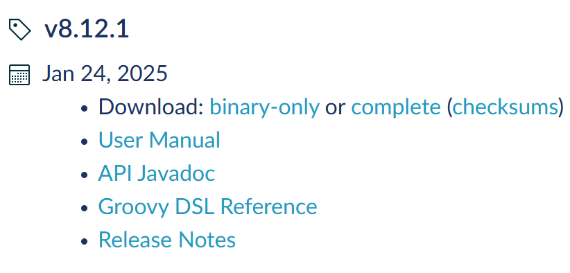

## 프로젝트 기본 설정

저번 시간에 백엔드 기본 세팅을 해봤습니다.

그런데 익숙하지 않은 IDE에 많이 헤매면서 제대로  생성되지 않았기 때문에 다시 천천히 세팅해보고자 합니다.

[https://congsong.tistory.com/12?category=749196](https://congsong.tistory.com/12?category=749196) 이 분의 블로그 글을 보면서 따라합니다.

---

[open JDK  다운로드](https://github.com/ojdkbuild/ojdkbuild)를 해줍니다.

버전은 17 버전으로 다운 받을 겁니다.

### 폴더 생성

다운 받은 후에 폴더를 세팅합니다.

C드라이브 아래 `develop`폴더를 생성하고 `jdk`와 `workspace`폴더를 만들어줍니다.

그리고 `jdk`폴더에서 다운로드 받은 jdk의 압축을 풀어줍니다. 이때 압축을 해제하고 나서 폴더명을 `ojdk-17`로 변경합니다.

이제 윈도우에서 Java가 정상적으로 작동할 수 있게 환경 변수를 설정합니다.

새 시스템 변수를 생성해줍니다.

그 다음에 시스템 변수의 Path를 선택하여 편집을 누르고 새로만들기를 눌러서 `%JAVA_HOME%\bin`을 입력합니다.

그리고 새로 생성한 것을 최상단으로 올립니다.

이런 새 시스템변수도 만들어줍니다.

그다음 명령 프롬프트에 들어가서 `java`를 입력했을 때

이런 식으로 나오면 성공입니다.

### 스프링 부트 프로젝트 생성

스프링 이니셜라이저에 접속해서 [spring Boot 프로젝트 생성](https://start.spring.io/)을 해줍니다.

인텔리제이 Ultimate 버전은 IDE 내에서 스프링부트 프로젝트를 생성할 수 있지만 Community 버전은 인텔리제이 이니셜라이저에서 직접 생성해야합니다.

MyBatis설정하느라 고생을 많이 했기 때문에 이번에는 미리 추가해주고 시작합니다. 

로그인, 회원가입 기능을 넣어야하기 때문에 Security도 넣어주었습니다.

그리고 아까 만들었던 `workspace`폴더에 생성한 프로젝트를 압축해제 합니다.

인텔리제이에서 Project Open을 하는데 아까 프로젝트 위치를 Open 합니다.

## 인텔리제이 자바 설정

`File` > `Project Structure`

여기서 Project 탭에서 SDK를 원하는 버전으로 변경해줍니다.

왼쪽 메뉴에서 `SDKs`를 눌러서 JDK가 동일한지 확인 하고  같은 것으로 바꿔줍니다.

**Gradle 설치**

[여기](https://gradle.org/releases/)에서 원하는 버전을 다운로드 합니다.

binary-only 또는 complete를 선택해서 다운받습니다.

`C:\gradle\`을 만들고 다운로드 받은 gradle 파일의 압축을 해제합니다.

시스템 환경 변수 편집 > 환경 변수 > Path 선택 후 편집 > 새로 만들기 > 찾아보기 > gradle 폴더의 bin 위치 선택

**설치확인**

CMD 창에서 `gradle -v`으로 설치 되어있는지 확인합니다.

이제 gradle이 정상적으로 설치가완료 되었습니다.